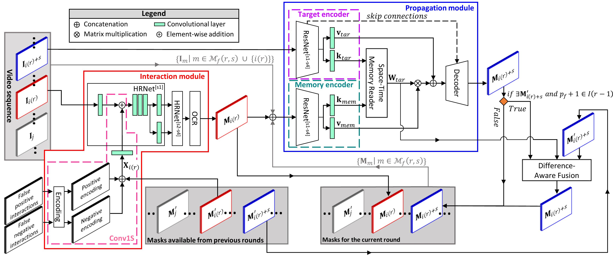

# CiVOS : Revisiting Click-Based Interactive Video Object Segmentation

Stephane Vujasinovic, Sebastian Bullinger, Stefan Becker, Norbert Scherer-Negenborn, Michael Arens, Rainer Stiefelhagen

### Paper
*Abstract*
>While current methods for interactive Video Object Segmentation (iVOS) rely on scribble-based interactions to generate precise object masks, we propose a Click-based interactive Video Object Segmentation (CiVOS) framework to simplify the required user workload as much as possible. CiVOS builds on de-coupled modules reflecting user interaction and mask propagation. The interaction module converts click-based interactions into an object mask, which is then inferred to the remaining frames by the propagation module. Additional user interactions allow for a refinement of the object mask. The approach is extensively evaluated on the popular interactive DAVIS dataset, but with an inevitable adaptation of scribble-based interactions with click-based counterparts. We consider several strategies for generating clicks during our evaluation to reflect various user inputs and adjust the DAVIS performance metric to perform a hardware-independent comparison. The presented CiVOS pipeline achieves competitive results, although requiring a lower user workload. 

[[arXiv]](https://arxiv.org/abs/2203.01784) [[Paper PDF]](https://arxiv.org/pdf/2203.01784.pdf)

### Setting up the environment
1. The framework is built with Python 3.7 and relies on the following packages:
   - NumPy `1.21.4`
   - SciPy `1.7.2`
   - PyTorch `1.10.0`
   - torchvision `0.11.1`
   - OpenCV `4.5.4` (opencv-python-headless if you don't want to use the demo)
   - Cython `0.29.24`
   - scikit-learn  `0.20.3`
   - scikit-image  `0.18.3`
   - scipy `1.7.2`
   - Pillow `8.4.0`
   - imgaug `0.4.0`
   - albumentations `1.10`
   - tqdm     `4.62.3`
   - PyYaml   `6.0`
   - easydict `1.9`
   - future   `0.18.2`
   - cffi     `1.15.0`
   - [davis-interactive](https://github.com/albertomontesg/davis-interactive) `1.0.4` 
   - networkx `2.6.3` for DAVIS
   - gdown `4.2.0` for downloading pretrained models 
2. Download the DAVIS dataset `download_dataset.py`
3. Download the pretrained models `download_models.py`

### Guide for Demo
1. Adapt the paths and variables in [`Demo.yml`](Demo.yml)
2. Launch [`CiVOS_Demo.py`](CiVOS_Demo.py) (*Nota bene: only 1 object can be segmented in the Demo*)
3. Mouse and keyboard bindings:
    - Positive interaction: `left mouse click`
    - Negative interaction: `right mouse click`
    - Predict a mask of the object of interest for the video sequence: `space bar`
    - Visualize the results with the keys `x`(forward direction) and `y`(backward direction) 
    - Quit the demo with key `q`

### How to evaluate on DAVIS
1. Adapt the paths and variables of [`EXAMPLE_DEBUGGING.yml`](evaluation_space/eval_example/EXAMPLE_DEBUGGING.yml)
2. Adapt and lauch the bash file [`CiVOS_evaluation_script_example.sh`](CiVOS_evaluation_script_example.sh)
3. Read .csv files results with [`Summarize_with_DAVIS_arbitrary_report.py`](evaluation_space/Summarize_with_DAVIS_arbitrary_report.py)

### Results

Quantitative evaluation on the interactive DAVIS 2017 validation set.
| Methods   | Training interaction | Testing interaction | R-AUC-J&F	| AUC-J&F  | J&F@60s  |
| ---       | ---                  | ---                 | ---       | ---      | ---      |
| MANet     | Scribbles            | Scribbles           | 0.72      | 0.79     | 0.79     |
| ATNet     | Scribbles            | Scribbles           | 0.75      | 0.80     | 0.80     |
| MiVOS     | Scribbles            | Scribbles           | **0.81**  | **0.87** | **0.88** |
| GIS-RAmap | Scribbles            | Scribbles           | 0.79      | 0.86     | 0.87     |
| MiVOS     | Clicks               | Clicks              | 0.70      | 0.78     | 0.79     |
| CiVOS     | Clicks               | Clicks              | **0.76**  | **0.83** | **0.84** |

R-AUC-J&F results on the DAVIS 2017 validation set for CiVOS by generating clicks in three different ways.
| Maximal Number of Clicks  | 1     | 2    | 3    | 4    | 5    | 6    | 7    |
| ---                       |---    |---   |---   |---   |---   |---   |---   |
| Interaction Strategy 1    | 0.69  | -    | -    | -    | -    | -    | -    |
| Interaction Strategy 2    | 0.72  | 0.76 | 0.76 | 0.75 | 0.75 | 0.75 | 0.76 |
| Interaction Strategy 3    | 0.74  | 0.77 | 0.78 | 0.78 | 0.78 | 0.78 | 0.78 |

### Credits

**RiTM**: [GitHub](https://github.com/hkchengrex/MiVOS), [Paper](https://arxiv.org/pdf/2103.07941.pdf)

**MiVOS**: [GitHub](https://github.com/saic-vul/ritm_interactive_segmentation), [Paper](https://arxiv.org/pdf/2103.07941.pdf)

**DeepLabV3Plus**: [GitHub](https://github.com/VainF/DeepLabV3Plus-Pytorch), [Paper](https://arxiv.org/pdf/1802.02611.pdf)

**DAVIS-interactive**: [GitHub](https://github.com/albertomontesg/davis-interactive), [Project](https://interactive.davischallenge.org/)
